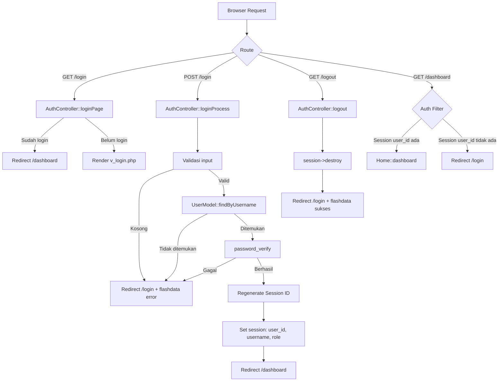
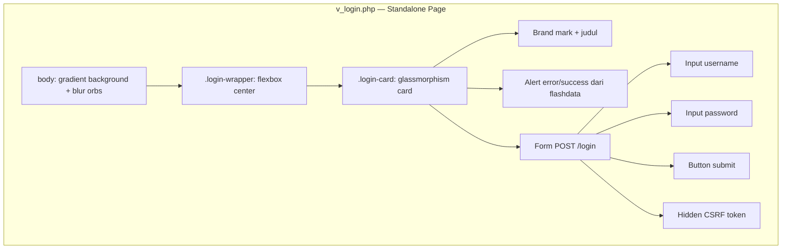

# Design Document: User Login — Dante Store

## Overview

Dokumen ini mendeskripsikan desain teknis untuk fitur autentikasi berbasis session pada aplikasi Dante Store (CodeIgniter 4). Fitur ini memproteksi area dashboard dari akses tidak sah dengan mengimplementasikan halaman login, proses autentikasi, filter route, dan fungsi logout.

**Keputusan desain utama:**
- Autentikasi menggunakan session CI4 berbasis file (sudah dikonfigurasi), bukan JWT atau cookie mandiri, karena aplikasi ini adalah web tradisional server-rendered.
- Password disimpan sebagai bcrypt hash menggunakan `password_hash()` PHP native — tidak memerlukan library tambahan.
- Halaman login adalah standalone page (tidak extend `layout.php`) karena tidak memerlukan navbar/footer publik, namun tetap menggunakan CSS variables dan font yang sama untuk konsistensi visual.
- Filter `auth` diterapkan via `$filters` di `Filters.php` (bukan `$globals`) agar hanya berlaku pada route dashboard, bukan seluruh aplikasi.

---

## Architecture

Alur request autentikasi mengikuti pola MVC standar CI4 dengan tambahan Filter layer:



**Komponen baru yang dibuat:**

| Komponen | Path | Tanggung Jawab |
|---|---|---|
| `AuthController` | `app/Controllers/AuthController.php` | Login page, proses login, logout |
| `AuthFilter` | `app/Filters/AuthFilter.php` | Proteksi route dashboard |
| `UserModel` | `app/Models/UserModel.php` | Query tabel `users` |
| Migration | `app/Database/Migrations/YYYY-MM-DD-HHMMSS_CreateUsersTable.php` | Buat tabel `users` |
| Seeder | `app/Database/Seeds/UserSeeder.php` | Data akun admin default |
| Login View | `app/Views/v_login.php` | Halaman login standalone |

**File yang dimodifikasi:**

| File | Perubahan |
|---|---|
| `app/Config/Routes.php` | Tambah route GET/POST `/login` dan GET `/logout` |
| `app/Config/Filters.php` | Tambah alias `auth` dan terapkan ke `dashboard*` |

---

## Components and Interfaces

### AuthController

```php
namespace App\Controllers;

class AuthController extends BaseController
{
    // GET /login — tampilkan halaman login
    // Jika sudah login, redirect ke /dashboard
    public function loginPage(): string|\CodeIgniter\HTTP\RedirectResponse

    // POST /login — proses form login
    // Validasi input → cari user → verifikasi password → set session → redirect
    public function loginProcess(): \CodeIgniter\HTTP\RedirectResponse

    // GET /logout — hapus session, redirect ke /login
    public function logout(): \CodeIgniter\HTTP\RedirectResponse
}
```

**Dependency:** `UserModel` (diload via `model()` helper CI4), `session()` service.

### AuthFilter

```php
namespace App\Filters;

use CodeIgniter\Filters\FilterInterface;

class AuthFilter implements FilterInterface
{
    // Dipanggil sebelum request ke route yang dilindungi
    // Cek session user_id — jika tidak ada, redirect ke /login
    public function before(RequestInterface $request, $arguments = null)

    // Tidak digunakan
    public function after(RequestInterface $request, ResponseInterface $response, $arguments = null)
}
```

### UserModel

```php
namespace App\Models;

use CodeIgniter\Model;

class UserModel extends Model
{
    protected $table      = 'users';
    protected $primaryKey = 'id';
    protected $returnType = 'array';
    protected $allowedFields = ['username', 'password', 'role'];

    // Cari user berdasarkan username (case-sensitive)
    // Return: array user | null
    public function findByUsername(string $username): ?array
}
```

### Perubahan Routes.php

```php
// Auth routes
$routes->get('login',  'AuthController::loginPage');
$routes->post('login', 'AuthController::loginProcess');
$routes->get('logout', 'AuthController::logout');

// Dashboard — dilindungi filter auth (didefinisikan di Filters.php)
$routes->get('dashboard', 'Home::dashboard');
```

### Perubahan Filters.php

```php
// Tambah alias
public array $aliases = [
    // ... existing aliases ...
    'auth' => \App\Filters\AuthFilter::class,
];

// Terapkan filter ke route dashboard
public array $filters = [
    'auth' => ['before' => ['dashboard', 'dashboard/*']],
];
```

---

## Data Models

### Tabel `users`

```sql
CREATE TABLE users (
    id         INT          NOT NULL AUTO_INCREMENT,
    username   VARCHAR(100) NOT NULL,
    password   VARCHAR(255) NOT NULL,
    role       ENUM('admin','operator') NOT NULL DEFAULT 'operator',
    created_at DATETIME     NULL,
    updated_at DATETIME     NULL,
    PRIMARY KEY (id),
    UNIQUE KEY uq_users_username (username)
) ENGINE=InnoDB DEFAULT CHARSET=utf8mb4 COLLATE=utf8mb4_unicode_ci;
```

**Keputusan desain:**
- `password` VARCHAR(255) — cukup untuk bcrypt hash (60 karakter) dengan ruang untuk algoritma lain di masa depan.
- `role` ENUM dengan dua nilai — cukup untuk kebutuhan saat ini. Jika role bertambah, bisa diubah ke tabel terpisah.
- `created_at` / `updated_at` NULL — CI4 Model mengisi otomatis jika `$useTimestamps = true`.
- Tidak ada kolom `email` atau `remember_token` — di luar scope fitur ini.

### Session Data (setelah login berhasil)

```php
// Data yang disimpan di session CI4
[
    'user_id'  => 1,          // int — primary key tabel users
    'username' => 'admin',    // string — untuk ditampilkan di UI
    'role'     => 'admin',    // string — untuk otorisasi di masa depan
]
```

### Migration File

```php
// app/Database/Migrations/YYYY-MM-DD-HHMMSS_CreateUsersTable.php
namespace App\Database\Migrations;

use CodeIgniter\Database\Migration;

class CreateUsersTable extends Migration
{
    public function up(): void
    {
        $this->forge->addField([
            'id'         => ['type' => 'INT', 'auto_increment' => true],
            'username'   => ['type' => 'VARCHAR', 'constraint' => 100, 'null' => false],
            'password'   => ['type' => 'VARCHAR', 'constraint' => 255, 'null' => false],
            'role'       => ['type' => 'ENUM', 'constraint' => ['admin', 'operator'],
                             'default' => 'operator', 'null' => false],
            'created_at' => ['type' => 'DATETIME', 'null' => true],
            'updated_at' => ['type' => 'DATETIME', 'null' => true],
        ]);
        $this->forge->addKey('id', true);
        $this->forge->addUniqueKey('username');
        $this->forge->createTable('users');
    }

    public function down(): void
    {
        $this->forge->dropTable('users');
    }
}
```

### Seeder

```php
// app/Database/Seeds/UserSeeder.php
namespace App\Database\Seeds;

use CodeIgniter\Database\Seeder;

class UserSeeder extends Seeder
{
    public function run(): void
    {
        $data = [
            'username'   => 'admin',
            'password'   => password_hash('admin123', PASSWORD_BCRYPT),
            'role'       => 'admin',
            'created_at' => date('Y-m-d H:i:s'),
            'updated_at' => date('Y-m-d H:i:s'),
        ];
        $this->db->table('users')->insert($data);
    }
}
```

### Desain Halaman Login (`v_login.php`)

Halaman login adalah standalone HTML page (tidak extend `layout.php`) dengan karakteristik:

- Menggunakan CSS variables yang sama (`--brand`, `--brand-2`, `--surface`, `--shadow`) dan font yang sama (Manrope + Space Grotesk) via CDN.
- Background gradient + blur orbs identik dengan `layout.php` untuk konsistensi visual.
- Card login di tengah layar dengan efek glassmorphism (`backdrop-filter: blur`).
- Form berisi: field `username`, field `password` (type=password), tombol submit, dan hidden CSRF token.
- Pesan error ditampilkan dari `session()->getFlashdata('error')` jika ada.
- Pesan sukses (logout) ditampilkan dari `session()->getFlashdata('success')` jika ada.



---

## Correctness Properties

*A property is a characteristic or behavior that should hold true across all valid executions of a system — essentially, a formal statement about what the system should do. Properties serve as the bridge between human-readable specifications and machine-verifiable correctness guarantees.*

### Property Reflection

Sebelum menulis properties final, dilakukan refleksi untuk menghilangkan redundansi:

- **2.5 dan 2.7** (username tidak ditemukan vs password salah → pesan error generik) dapat digabung dengan **6.4** (semua kegagalan login menghasilkan pesan identik) menjadi satu property komprehensif tentang error message uniformity.
- **2.8 dan 2.9** (session data tersimpan + redirect ke dashboard) dapat digabung menjadi satu property tentang login success state.
- **3.1 dan 3.3** (filter menolak tanpa session + mengizinkan dengan session) dapat digabung menjadi satu property round-trip tentang filter behavior.
- **4.2 dan 4.3** (session dihapus + redirect ke login) dapat digabung menjadi satu property tentang logout state.
- **1.2** (redirect jika sudah login) adalah kebalikan dari 3.1 — tetap dipertahankan sebagai property terpisah karena menguji komponen berbeda (controller vs filter).

Setelah refleksi, tersisa **6 properties** yang unik dan tidak redundan.

---

### Property 1: Redirect ke dashboard jika sudah login

*For any* session yang mengandung `user_id` yang valid, request `GET /login` harus menghasilkan redirect ke `/dashboard`, bukan menampilkan halaman login.

**Validates: Requirements 1.2**

---

### Property 2: Flashdata error ditampilkan di halaman login

*For any* string pesan error yang disimpan di session flashdata dengan key `'error'`, halaman login yang dirender harus mengandung teks pesan tersebut dalam output HTML.

**Validates: Requirements 1.6**

---

### Property 3: Input kosong atau whitespace ditolak

*For any* kombinasi input di mana `username` atau `password` (atau keduanya) adalah string kosong atau hanya terdiri dari whitespace, `POST /login` harus mengembalikan redirect ke `/login` dengan flashdata error, dan tidak boleh melakukan query ke database.

**Validates: Requirements 2.2, 2.3**

---

### Property 4: Login berhasil menghasilkan session lengkap dan redirect

*For any* user yang ada di tabel `users` dengan password yang cocok, setelah `POST /login` berhasil: (a) session harus mengandung `user_id`, `username`, dan `role` yang sesuai dengan data user tersebut, (b) session ID harus berbeda dari session ID sebelum login (regenerasi), dan (c) response harus redirect ke `/dashboard`.

**Validates: Requirements 2.8, 2.9, 6.5**

---

### Property 5: Semua kegagalan login menghasilkan pesan error yang identik

*For any* kombinasi kegagalan login — baik karena username tidak ditemukan di database maupun karena password tidak cocok dengan hash yang tersimpan — pesan error yang dikembalikan ke halaman login harus selalu identik ("Username atau password salah"), tidak membedakan jenis kegagalan.

**Validates: Requirements 2.5, 2.7, 6.4**

---

### Property 6: Auth filter memblokir request tanpa session dan mengizinkan dengan session

*For any* request ke `/dashboard` atau sub-route-nya: jika session tidak mengandung `user_id` yang valid, filter harus redirect ke `/login`; jika session mengandung `user_id` yang valid, request harus diteruskan ke controller tanpa redirect.

**Validates: Requirements 3.1, 3.2, 3.3**

---

### Property 7: Logout menghapus semua session data dan redirect ke login

*For any* session aktif yang mengandung data login (user_id, username, role), setelah `GET /logout`: (a) session tidak boleh lagi mengandung `user_id`, dan (b) response harus redirect ke `/login`.

**Validates: Requirements 4.2, 4.3**

---

### Property 8: Password tersimpan sebagai bcrypt hash, bukan plaintext

*For any* password string yang digunakan saat membuat atau memperbarui akun user, nilai yang tersimpan di kolom `password` tabel `users` harus: (a) dimulai dengan `$2y$` (penanda bcrypt), (b) dapat diverifikasi dengan `password_verify($plaintext, $hash)` yang mengembalikan `true`, dan (c) tidak sama dengan string plaintext aslinya.

**Validates: Requirements 6.1**

---

## Error Handling

### Skenario Error dan Penanganannya

| Skenario | Penanganan | Pesan ke User |
|---|---|---|
| Input username/password kosong | Redirect ke `/login` + flashdata | "Username dan password wajib diisi." |
| Username tidak ditemukan di DB | Redirect ke `/login` + flashdata | "Username atau password salah." |
| Password tidak cocok | Redirect ke `/login` + flashdata | "Username atau password salah." |
| Akses `/dashboard` tanpa session | Redirect ke `/login` | *(tidak ada pesan, langsung redirect)* |
| Database error saat query | Log error CI4, redirect ke `/login` | "Terjadi kesalahan sistem. Coba lagi." |

**Prinsip error handling:**
- Pesan error untuk kegagalan autentikasi selalu generik — tidak membocorkan apakah username atau password yang salah (mencegah username enumeration).
- Error database di-log menggunakan `log_message('error', ...)` CI4, tidak ditampilkan ke user.
- Tidak ada retry limit di scope fitur ini (bisa ditambahkan sebagai fitur terpisah).

### Validasi Input

```php
// Di AuthController::loginProcess()
$rules = [
    'username' => 'required|min_length[1]',
    'password' => 'required|min_length[1]',
];
```

Validasi menggunakan CI4 Validation service. Jika gagal, redirect ke `/login` dengan error dari `$this->validator->getErrors()` atau pesan custom.

---

## Testing Strategy

### Pendekatan Dual Testing

Fitur ini menggunakan dua lapisan pengujian yang saling melengkapi:

1. **Unit/Example tests** — verifikasi perilaku spesifik dengan contoh konkret
2. **Property-based tests** — verifikasi properti universal di berbagai input yang di-generate

### Library Property-Based Testing

Gunakan **[Eris](https://github.com/giorgiosironi/eris)** — library PBT untuk PHP yang terintegrasi dengan PHPUnit. Instalasi:

```bash
composer require --dev giorgiosironi/eris
```

Setiap property test dikonfigurasi minimum **100 iterasi** via `$this->limitTo(100)` atau default Eris.

### Unit Tests (PHPUnit)

**AuthController:**
- `GET /login` mengembalikan status 200
- `GET /login` saat sudah login → redirect 302 ke `/dashboard`
- `POST /login` dengan input valid → redirect ke `/dashboard`
- `POST /login` dengan username tidak ada → redirect ke `/login`
- `POST /login` dengan password salah → redirect ke `/login`
- `GET /logout` → session kosong + redirect ke `/login`
- Response `GET /login` mengandung `input[name=username]`, `input[name=password]`, CSRF hidden input

**AuthFilter:**
- Request ke `/dashboard` tanpa session → redirect ke `/login`
- Request ke `/dashboard` dengan session valid → diteruskan (status bukan 302)

**UserModel:**
- `findByUsername('admin')` mengembalikan array dengan key yang benar
- `findByUsername('nonexistent')` mengembalikan `null`

**Migration:**
- Tabel `users` terbuat dengan kolom yang benar setelah migrasi dijalankan

### Property-Based Tests (Eris)

Setiap test di-tag dengan komentar referensi ke property di dokumen ini.

```php
// Tag format: Feature: user-login, Property {N}: {property_text}
```

**Property 1 — Redirect jika sudah login:**
```php
// Feature: user-login, Property 1: Redirect ke dashboard jika sudah login
// Generate: berbagai user_id valid (int positif)
// Verifikasi: GET /login dengan session berisi user_id → selalu redirect ke /dashboard
```

**Property 2 — Flashdata error ditampilkan:**
```php
// Feature: user-login, Property 2: Flashdata error ditampilkan di halaman login
// Generate: berbagai string pesan error (termasuk karakter khusus, unicode)
// Verifikasi: HTML response GET /login selalu mengandung teks pesan tersebut
```

**Property 3 — Input kosong/whitespace ditolak:**
```php
// Feature: user-login, Property 3: Input kosong atau whitespace ditolak
// Generate: kombinasi string whitespace untuk username dan/atau password
// Verifikasi: POST /login selalu redirect ke /login, tidak ada query DB
```

**Property 4 — Login berhasil menghasilkan session lengkap:**
```php
// Feature: user-login, Property 4: Login berhasil menghasilkan session lengkap dan redirect
// Generate: berbagai user valid (user_id int, username string, role enum)
// Verifikasi: session mengandung user_id/username/role yang benar, session ID berubah, redirect ke /dashboard
```

**Property 5 — Pesan error identik untuk semua kegagalan:**
```php
// Feature: user-login, Property 5: Semua kegagalan login menghasilkan pesan error yang identik
// Generate: username tidak ada di DB, password salah untuk username yang ada
// Verifikasi: pesan error selalu "Username atau password salah." untuk semua skenario gagal
```

**Property 6 — Auth filter behavior:**
```php
// Feature: user-login, Property 6: Auth filter memblokir request tanpa session dan mengizinkan dengan session
// Generate: berbagai session state (kosong, berisi user_id valid, berisi data tidak valid)
// Verifikasi: tanpa user_id → redirect /login; dengan user_id valid → tidak redirect
```

**Property 7 — Logout menghapus session:**
```php
// Feature: user-login, Property 7: Logout menghapus semua session data dan redirect ke login
// Generate: berbagai session data aktif (berbagai user_id, username, role)
// Verifikasi: setelah logout, session tidak mengandung user_id, response redirect ke /login
```

**Property 8 — Password tersimpan sebagai bcrypt hash:**
```php
// Feature: user-login, Property 8: Password tersimpan sebagai bcrypt hash, bukan plaintext
// Generate: berbagai password string (pendek, panjang, karakter khusus, unicode)
// Verifikasi: hash dimulai $2y$, password_verify() = true, hash != plaintext
```

### Catatan Testing

- Property tests untuk controller (Property 1–7) menggunakan **mock** untuk database dan session agar tidak memerlukan koneksi database nyata dan tetap cepat.
- Property 8 adalah pure function test — tidak memerlukan mock, hanya menguji `password_hash()` dan `password_verify()`.
- Integration test (opsional, di luar scope unit test): jalankan migrasi + seeder di test database, lakukan login end-to-end.
